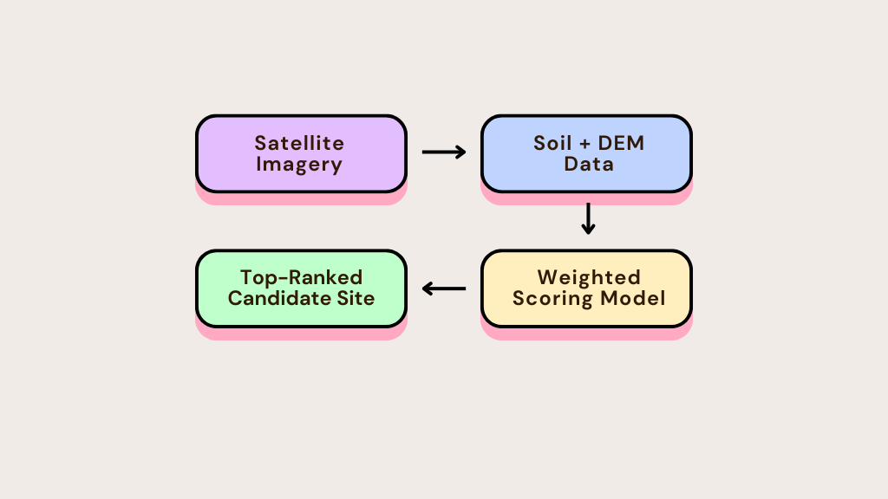

# A Multi-Criteria Approach to Archaeological Prospection in the Amazon

### OpenAI to Z Challenge Submission by Anouar Adel

---

## Executive Summary

This project presents a comprehensive methodology for identifying high-potential, undiscovered pre-Columbian sites in the state of Acre, Brazil. Moving beyond simplistic anomaly detection, this work integrates multiple independent data sources into a sophisticated, weighted scoring model to rank over 300,000 potential sites.

Our research revealed that Acre's archaeological signature is dominated by massive geoglyphs, making the classic *Terra Preta* (Amazonian Dark Earths) a poor indicator for new sites. Our strategy was therefore adapted to this nuanced context, combining four key layers of evidence to identify promising locations.

This process culminates in the identification of a top-ranked "hero" candidate: a site that, while not exhibiting signs of classic Terra Preta, possesses a compelling combination of high *relative* soil organic carbon and an ideal landscape position, marking it as a high-priority target for future archaeological investigation. The full reproducible workflow is detailed in the accompanying Jupyter Notebook.

---

## The Multi-Criteria Methodology

Our approach was to design a pipeline that could analyze **312,127 anomaly footprints** (derived from Google Earth Engine) and score each one based on a weighted combination of factors to determine its "Archaeological Potential Score".

The model combines four key layers of evidence:

1.  **Anomaly Footprints:** Generated from a large-scale analysis of Sentinel-2 satellite imagery to identify vegetation clearings.
2.  **Soil Characteristics:** Utilizing Soil Organic Carbon (SOC) data as a proxy for human activity. Our model scores sites based on SOC levels that are anomalously high *relative to the region*.
3.  **Landscape Position:** Incorporating a Digital Elevation Model (DEM) to score sites based on topographic suitability, prioritizing high, flat uplands—classic settlement locations.
4.  **Novelty Verification:** Cross-referencing top candidates against known archaeological databases and historical texts (like Colonel Percy Fawcett's journal) to confirm they are new discoveries.

---

## Repository Contents

*   `Archaeological_Prospection_Analysis.ipynb`: The main Jupyter Notebook containing the entire reproducible workflow, from data ingestion and processing to multi-criteria scoring and final candidate analysis.
*   `assets/`: A folder containing the diagrams and visual assets used in this README.

---

## Author

**Anouar Adel**
*   **GitHub:** [@AnouarAdel](https://github.com/AnouarAdel)
*   **LinkedIn:** [Anouar Adel](https://www.linkedin.com/in/anouar-adel-0a4928323/)
*   **Email:** [adelanouar60@gmail.com](mailto:adelanouar60@gmail.com)

---

## License

This project is licensed under the MIT License. See the [LICENSE](LICENSE) file for details.